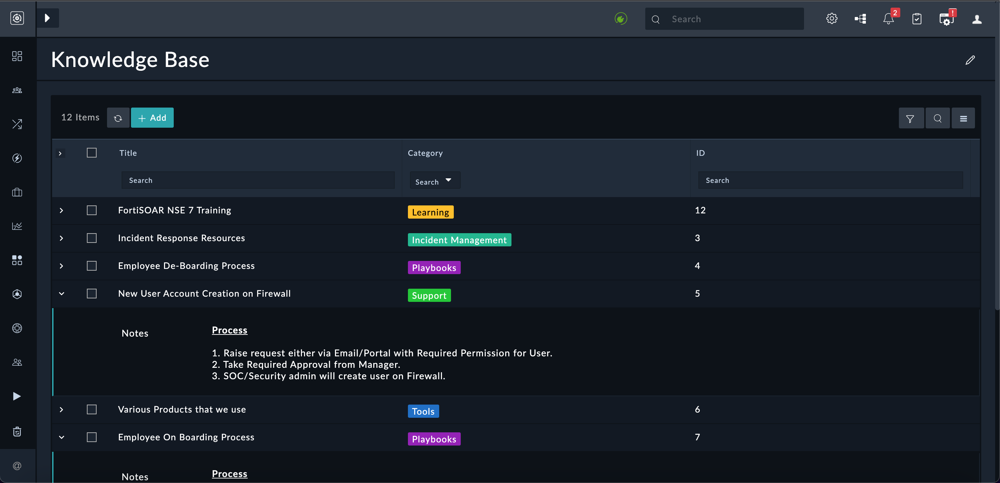

# Knowledge Base Solution Pack

## Release Information

- Solution Pack Version: 1.0.1
- Minimum Compatible FortiSOAR™ Version: 7.2.0
- Authored By: Fortinet
- Certified: No

## Overview

*Knowledge Base* solution pack provides knowledge about best practices, triage process, tools, etc. used in a FortiSOAR.

### Usage

The Knowledge Base Solution Pack contains the following:

- Knowledge Base Module: The Knowledge Base module contains records that explain to the user different process, tools, etc used on SOAR.
- KBCategory Picklist: A picklist using which users can categorize records created in the Knowledge Base module.
- Records that are related to the Knowledge Base: These are sample records that are created in the Knowledge Base module, which provide the users with tools and processes used in FortiSOAR and SOARs in general:  
  

## Prerequisites

|**Solution Pack Name**|**Purpose**|**Doc Link**|
| :- | :- | :- |
|SOAR Framework 1.0.0|Require for Incident Response modules|[Click here](https://github.com/fortinet-fortisoar/solution-pack-soar-framework/blob/develop/README.md)|

## Contents

1. Record Set(s)
    - Scenario: Knowledge Base (12)
2. Module Schema(s)
    - Knowledge Base
3. Picklist(s)
    - KBCategory
