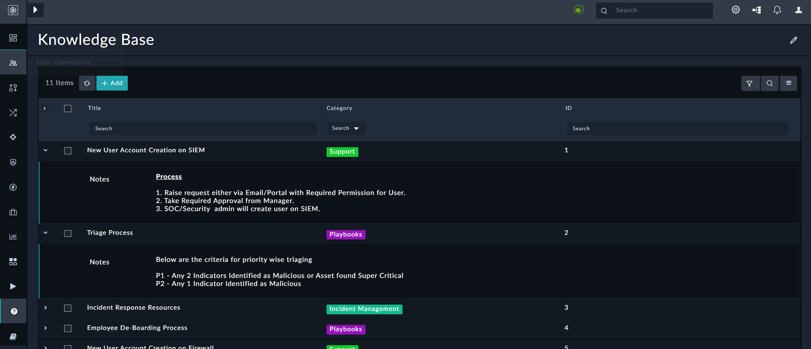

# Knowledge Base Solution Pack v1.0.0

## Overview

This article describes the FortiSOAR™ Knowledge Base Solution Pack (solution-pack-knowledge-base). 

FortiSOAR™ is built using modular architecture and the FortiSOAR™ Knowledge Base Solution Pack is the implementation of the best practices to configure and use FortiSOAR™ in an optimal manner. The FortiSOAR™ Knowledge Base Solution Pack provides the user with information about different things like (triage process, tools etc) used in a SOAR.

## Prerequisites

- Deploy the Knowledge Base Solution Pack. However, before you deploy the Knowledge Base Solution Pack, ensure that you have deployed the FortiSOAR™ Incident Response Solution Pack ([solution-pack-incident-response](https://github.com/fortinet-fortisoar/solution-pack-incident-response)). The steps for deploying a solution pack are mentioned in the [Deploying a Solution Pack](https://github.com/fortinet-fortisoar/how-tos/blob/main/DeployingASolutionPack.md) article. 

## Contents of the Knowledge Base Solution Pack
The Knowledge Base Solution Pack contains the following:

- Knowledge Base Module: The Knowledge Base module contains records that explain to the user different process, tools, etc used on SOAR.
- KBCategory Picklist: A picklist using which users can categorize records created in the Knowledge Base module.
- Records that are related to the Knowledge Base: These are sample records that are created in the Knowledge Base module, which provide the users with tools and processes used in FortiSOAR and SOARs in general:  
  

