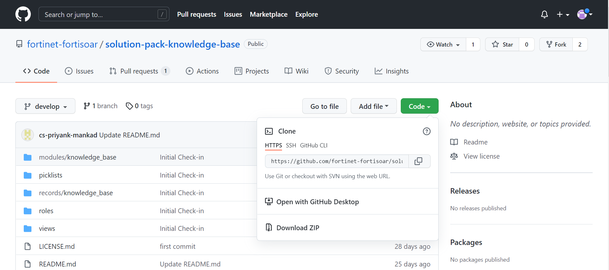

# Knowledge Base Solution Pack 7.0.2

## Overview

This article describes the FortiSOAR™ Knowledge Base Solution Pack (solution-pack-knowledge-base). 

FortiSOAR™ is built using modular architecture and the FortiSOAR™ Knowledge Base Solution Pack is the implementation of the best practices to configure and use FortiSOAR™ in an optimal manner. The FortiSOAR™ Knowledge Base Solution Pack provides the user with information about different things like (triage process, tools etc) used in a SOAR.

## Deploying Knowledge Base Solution Pack

**Important**: Before you deploy the solution pack, ensure that you have deployed the FortiSOAR™ Incident Response Solution Pack ([solution-pack-incident-response](https://github.com/fortinet-fortisoar/solution-pack-incident-response)).

1. Log onto the Solution Pack GIT repo [https://github.com/fortinet-fortisoar/solution-pack-knowledge-base](https://github.com/fortinet-fortisoar/solution-pack-knowledge-base) using your credentials.
2. Click the **Code** button and select the **Download ZIP** option.  
   
3. Log into your FortiSOAR instance, and on the left-navigation, click **Import Wizard**.  
   
4. On the `Import Wizard` page, click **Import From File** and selected the solution pack zip that you have downloaded, and navigate through the Import Wizard.  
     
   **Note**: It is recommended not the change any configurations or options of the imported solution pack zip file.  
   Once the import is successfully completed, you can use the Knowledge Base Solution Pack.

## Contents of the Knowledge Base Solution Pack
The Knowledge Base Solution Pack contains the following:

- Knowledge Base Module: The Knowledge Base module contains records that explain to the user different process, tools, etc used on SOAR.
- KBCategory Picklist: A picklist using which users can categorize records created in the Knowledge Base module.
- Records that are related to the Knowledge Base: These are sample records that are created in the Knowledge Base module, which provide the users with tools and processes used in FortiSOAR and SOARs in general:  
  

 